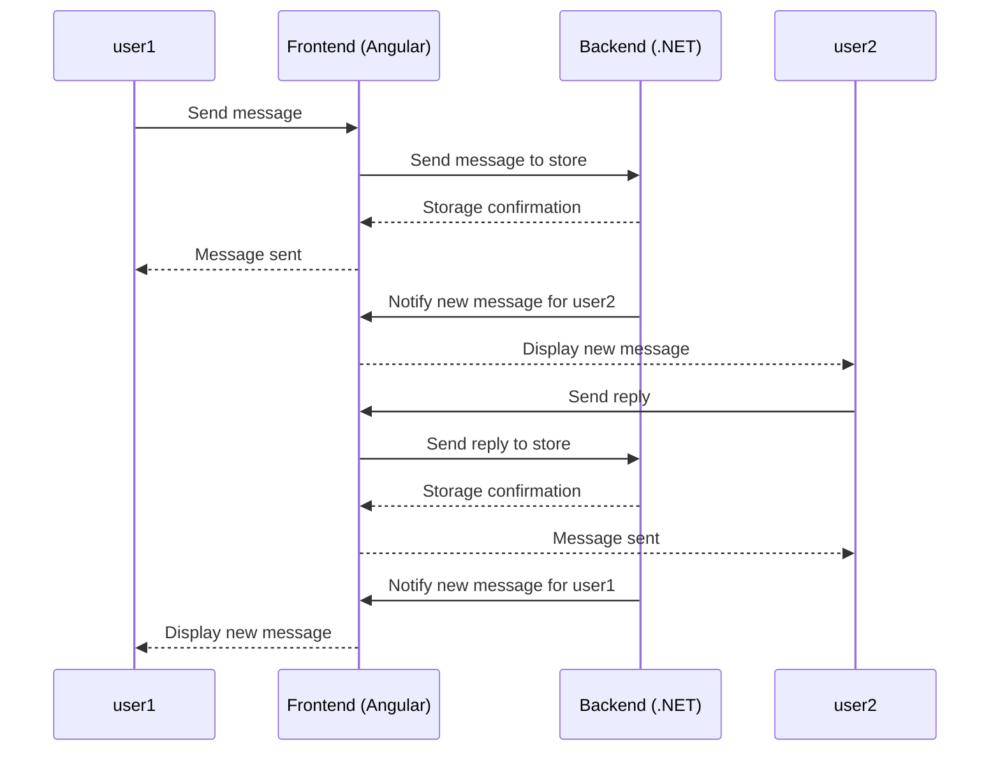
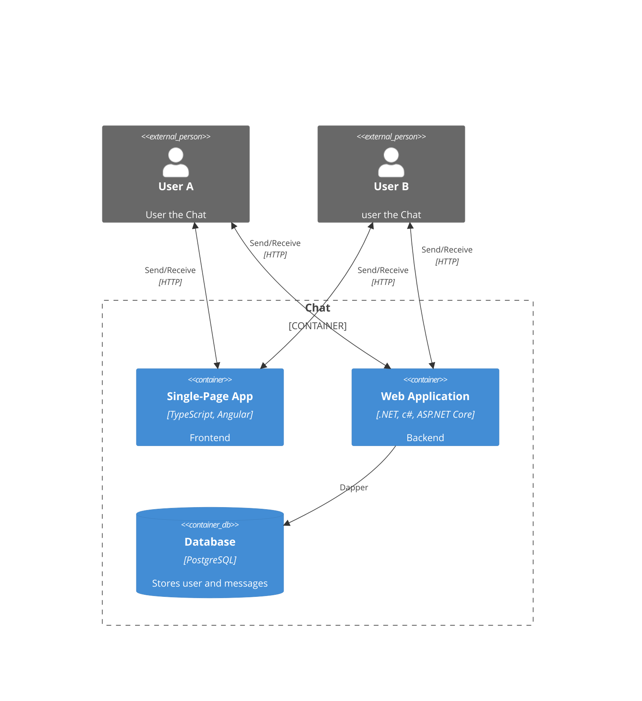

# Chat demo using Angular on the frontend and .NET on the backend

This project aims to present a solution for real-time communication using a chat system.

## Technologies Used:
- .NET 8
- ASP.NET Core
- Angular 16
- PostgreSQL
- Dapper
- SignalR

# Diagrams
## Sequence Diagram

## Context diagram

## Container diagram
