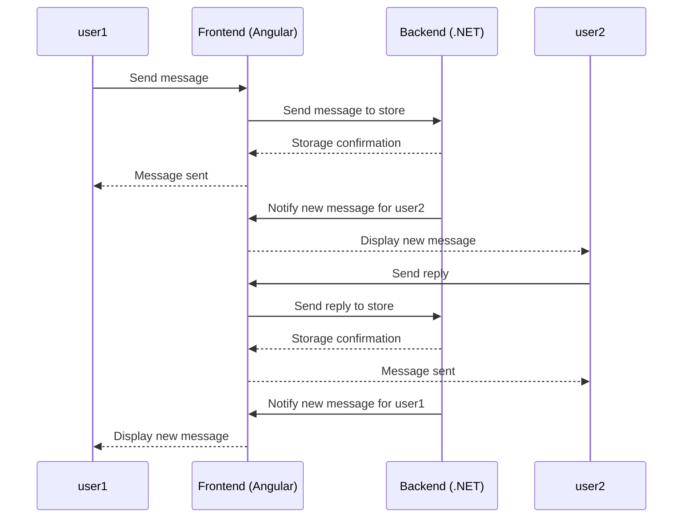

# Chat demo using Angular on the frontend and .NET on the backend

```mermaid
sequenceDiagram
    participant user1
    participant frontend as Frontend (Angular)
    participant backend as Backend (.NET)
    participant user2

    user1->>frontend: Send message
    frontend->>backend: Send message to store
    backend-->>frontend: Storage confirmation
    frontend-->>user1: Message sent
    backend->>frontend: Notify new message for user2
    frontend-->>user2: Display new message

    user2->>frontend: Send reply
    frontend->>backend: Send reply to store
    backend-->>frontend: Storage confirmation
    frontend-->>user2: Message sent
    backend->>frontend: Notify new message for user1
    frontend-->>user1: Display new message
```